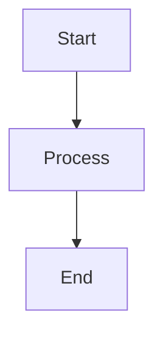

# Slidev Markdown Syntax Reference

## File Structure

A Slidev presentation is a single `slides.md` file. Slides are separated by `---` on its own line.

## Headmatter (First Slide Frontmatter)

The first frontmatter block configures the entire presentation:

```yaml
---
theme: default
title: My Presentation
info: |
  Presentation description
colorSchema: dark
fonts:
  sans: Space Grotesk
  serif: Playfair Display
  mono: JetBrains Mono
aspectRatio: 16/9
canvasWidth: 980
transition: slide-left
lineNumbers: true
drawings:
  enabled: false
---
```

### Key Headmatter Fields

| Field | Description | Example |
|-------|-------------|---------|
| `theme` | Theme package name | `default`, `seriph`, `apple-basic` |
| `title` | Presentation title | `"My Talk"` |
| `colorSchema` | Color mode | `light`, `dark`, `auto` |
| `fonts` | Google Fonts config | `{ sans: "Poppins" }` |
| `aspectRatio` | Slide ratio | `16/9`, `4/3` |
| `transition` | Default transition | `fade`, `slide-left` |
| `lineNumbers` | Code line numbers | `true`, `false` |
| `highlighter` | Code highlighter | `shiki`, `prism` |
| `download` | Enable PDF download | `true` |

## Per-Slide Frontmatter

Each slide can have its own frontmatter:

```markdown
---
layout: center
background: /images/bg.jpg
class: text-center
transition: fade
clicks: 3
---
```

### Per-Slide Fields

| Field | Description |
|-------|-------------|
| `layout` | Slide layout component |
| `background` | Background image/color |
| `class` | CSS classes for the slide |
| `transition` | Slide-specific transition |
| `clicks` | Total click count |
| `preload` | Preload next slide assets |

## Code Blocks

### Basic Code Block

````markdown
```ts
const hello = "world"
```
````

### Line Highlighting

````markdown
```ts {2,3}
const a = 1
const b = 2  // highlighted
const c = 3  // highlighted
```
````

### Step Highlighting (Click-Through)

````markdown
```ts {1|2-3|5}
const a = 1     // step 1
const b = 2     // step 2
const c = 3     // step 2
const d = 4
const e = 5     // step 3
```
````

### Filename Display

````markdown
```ts [server.ts]
import express from 'express'
```
````

### Line Numbers

````markdown
```ts {2|3} {lines:true, startLine:5}
// line 5
// line 6 (highlighted step 1)
// line 7 (highlighted step 2)
```
````

## Styling

### Scoped `<style>` Block

```markdown
<style>
h1 {
  color: #ff6b35;
  font-size: 3em;
}
</style>
```

Each slide's `<style>` block is scoped to that slide only.

### UnoCSS Classes

Slidev includes UnoCSS. Use utility classes directly:

```markdown
<div class="text-3xl font-bold text-blue-500 flex items-center gap-4">
  Styled content
</div>
```

Common UnoCSS patterns:
- Text: `text-xl`, `text-center`, `font-bold`, `text-gray-400`
- Spacing: `p-4`, `m-2`, `mt-8`, `gap-4`
- Flex: `flex`, `items-center`, `justify-between`
- Grid: `grid`, `grid-cols-2`, `gap-8`
- Effects: `opacity-80`, `rounded-lg`, `shadow-xl`

### Global Styles

Write to `styles/index.css` for global styles:

```css
:root {
  --slidev-theme-primary: #ff6b35;
  --slidev-theme-background: #0a0a0a;
}
```

## Images

### Inline Image

```markdown

```

### Background Image

```yaml
---
background: /images/bg.jpg
---
```

### Styled Image

```markdown

```

Images in the `public/` directory are served at root path.

## Slide Separators

```markdown
---    <!-- standard separator -->

---    <!-- with frontmatter -->
layout: center
---
```

## Presenter Notes

Add notes after a slide, below a comment marker:

```markdown
---

# My Slide

Content here

<!--
These are presenter notes.
Only visible in presenter mode.
-->
```

## HTML in Slides

Full HTML is supported in slides:

```markdown
<div class="grid grid-cols-2 gap-8">
  <div>
    Left column content
  </div>
  <div>
    Right column content
  </div>
</div>
```

## Math (KaTeX)

```markdown
$E = mc^2$

$$
\int_0^\infty f(x) dx
$$
```

## Diagrams (Mermaid)

````markdown

````

## Multi-File Slides

Import slides from other files:

```markdown
---
src: ./pages/intro.md
---

---
src: ./pages/content.md
---
```
